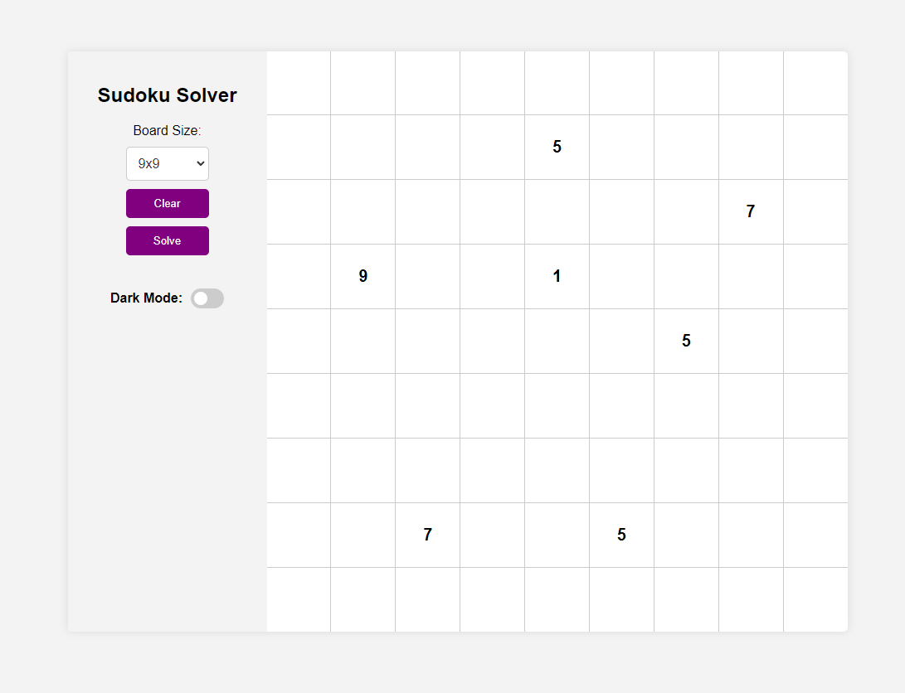
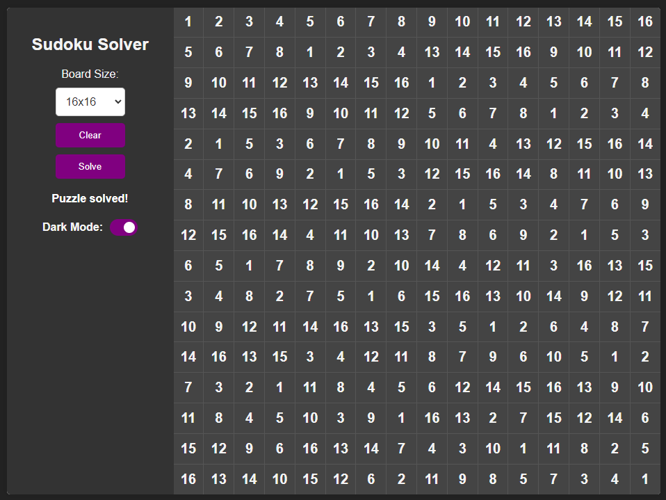

# Sudoku Solver

This Sudoku Solver is a web application written in HTML that allows you to solve Sudoku puzzles of various sizes, including 4x4, 9x9, and 16x16 boards. The solver is capable of quickly solving puzzles and adheres to the rules of Sudoku.

## Features

- Supports 4x4, 9x9, and 16x16 Sudoku boards.
- Allows switching between different board sizes.
- Allows entering your own puzzles for solving.
- Provides an option to clear the board and start fresh.
- Solves puzzles almost instantly.
- Adheres to the rules of Sudoku.

## Usage

1. Clone the repository or download the source code.
2. Open the `index.html` file in a web browser.
3. Select the desired board size from the provided options.
4. To enter a puzzle, click on the cells and input the numbers using your keyboard.
5. Click the solve button to solve the puzzle.
6. To clear the board, click the clear button.

## Preview

## License

This project is licensed under the [MIT License](LICENSE).

Feel free to contribute and improve the Sudoku Solver. If you encounter any issues or have suggestions, please create an issue in the [issue tracker](https://github.com/your-username/sudoku-solver/issues).

Happy Sudoku solving!
